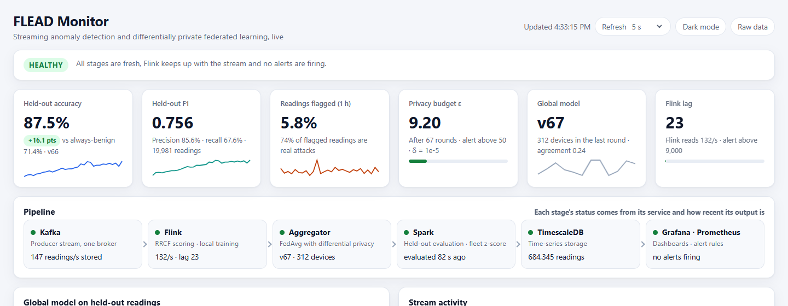
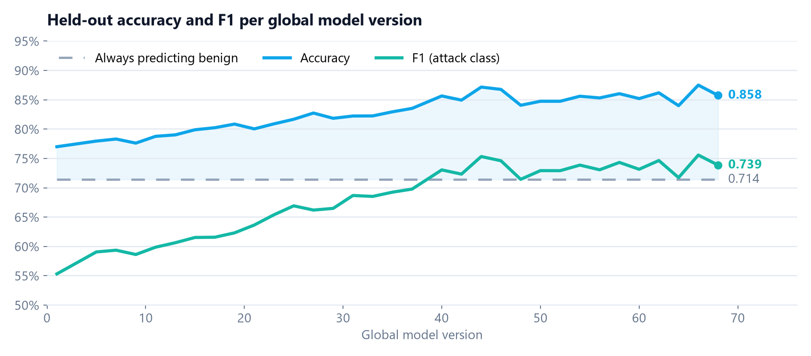
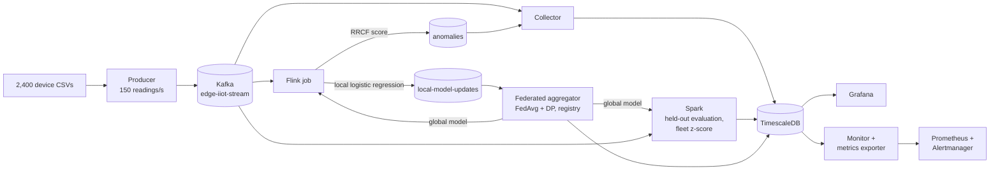

# FLEAD: Federated Learning for Edge Anomaly Detection

[](https://o-2wice.github.io/Federated-Learning-Anomaly-Detection/)
[](https://github.com/O-2wice/Federated-Learning-Anomaly-Detection/actions/workflows/tests.yml)


FLEAD streams real IoT network traffic from 2,400 simulated devices and runs
two detectors on it. One is label-free anomaly scoring on every reading. The
other is an attack classifier that the devices train together through
differentially private federated learning, without pooling their data. One
command starts the whole pipeline: Kafka, Flink, a
federated aggregator, Spark, TimescaleDB, Grafana and Prometheus.

## What it does

- **Streams** the Edge-IIoTset dataset as 2,400 concurrent devices at 150
  readings/s into a single KRaft Kafka broker. The producer confirms every
  delivery.
- **Scores every reading** in Flink with a Robust Random Cut Forest over 46
  features, using per-device adaptive thresholds. About 6% of readings are
  flagged, and 65–86% of those are real attacks across runs (28% base rate).
  No labels are involved.
- **Trains locally** in Flink: one logistic regression per device, on that
  device's recent readings, starting from the latest global model.
- **Aggregates privately** with buffered asynchronous FedAvg and DP-FedAvg
  (update clipping, Gaussian noise, Rényi-DP accountant). Each round's update
  agreement and client clusters are tracked.
- **Evaluates honestly:** Spark scores every global model on readings no device
  trained on, next to the always-benign baseline. A model registry rolls back
  automatically when held-out F1 drops.
- **Is observable:** a live pipeline monitor that shows each stage's freshness,
  model quality, privacy budget and alerts at a glance; 5 Grafana dashboards
  generated as code; Prometheus with 16 alert rules and Alertmanager; and a
  device viewer that links each device's data to its pipeline results.

## Results

From one 77-minute run of the full pipeline.

| | Result |
| --- | --- |
| Held-out accuracy / F1 of the global model | **0.858 / 0.739** after 68 rounds (77-minute run), vs 0.714 for always predicting benign |
| Same model without DP (offline, 60 devices × 660 readings) | 0.856 / 0.73 |
| Devices per federated round | Median 307 (200–502), about one round per minute |
| Privacy budget | ε = 9.35 after 69 rounds (δ = 1e-5); median DP noise std 0.016 |
| RRCF detection | 5.8% of readings flagged, 74% of them attacks live; ROC AUC 0.65–0.66 offline |
| Throughput | Flink keeps up with the 150 readings/s stream (Kafka lag 0). Retraining every ~3 readings had held it at ~105/s with a lag past a million readings; retraining every 30 fixed it |
| Delivery | 694,999 of 695,000 queued readings confirmed by Kafka, 0 failed (the last was in flight) |

Details and the experiments behind the settings:
[SYSTEM.md](SYSTEM.md#4-measured-results) and
[docs/RCF_EXPLAINED.md](docs/RCF_EXPLAINED.md). The full story, with architecture, design
decisions and results: [case study](https://o-2wice.github.io/Federated-Learning-Anomaly-Detection/).





## Architecture



How each stage works: [SYSTEM.md](SYSTEM.md). Containers, ports and volumes:
[DOCKER_ARCHITECTURE.md](DOCKER_ARCHITECTURE.md).

## Quick start

**Requirements:** Docker Desktop (about 8 GB RAM for Docker, 10 GB disk) and
Python 3 on the host; the orchestrator uses only the standard library. The
first run downloads the dataset from Kaggle, so place your API token at
`kaggle/kaggle.json` (git-ignored).

```bash
START.bat          # Windows
./start            # Linux, macOS, Git Bash
```

The script builds the images, starts the stack, submits the Flink and Spark
jobs and opens the web interfaces. The first global model
appears about 5 minutes after start, once devices have buffered enough
readings and 200 of them have reported; held-out metrics follow within 3
minutes.

```bash
STOP.bat           # Windows
./stop             # Linux, macOS, Git Bash
```

Stopping removes the project's containers and keeps all data volumes.

Default credentials (Grafana `admin` / `admin`, database `flead` / `password`)
can be changed by copying `.env.example` to `.env`.

## Web interfaces

| Interface | URL |
| --- | --- |
| Grafana dashboards | <http://localhost:3001> |
| Pipeline monitor | <http://localhost:5001> |
| Prometheus / Alertmanager | <http://localhost:9090> / <http://localhost:9093> |
| Flink | <http://localhost:8161> |
| Spark master / worker / running job | <http://localhost:8086> / <http://localhost:8087> / <http://localhost:4040> |
| Kafka UI | <http://localhost:8081> |
| Device viewer | <http://localhost:8082> |
| Jupyter | <http://localhost:8888> (JupyterLab takes about 15 s to load) |

Prometheus shows times in UTC until you tick *Use local time* on its graph page.

## Repository layout

```text
scripts/                pipeline code: producer, Flink job and models, aggregator,
                        Spark job, collector, metrics updater, orchestrator
tests/                  unit tests (run in CI)
docker/                 Dockerfiles; docker-compose.yml defines the 20 services
grafana/                dashboards (generated by build_dashboards.py) and provisioning
prometheus/             scrape config, alert rules, Alertmanager
monitoring_dashboard/   live pipeline monitor and Prometheus exporter (Flask)
device-viewer/          device file browser (Flask)
notebooks/              preprocessing walkthrough
docs/                   RRCF and Kafka design notes
```

## Tests

```bash
pip install -r requirements/tests.txt
pytest tests
```

53 unit tests run without Docker. They cover:

- the producer, including its delivery watchdog;
- device data generation;
- the RRCF and local model;
- federated aggregation, DP accounting and rollback;
- the evaluation metrics;
- the Grafana dashboards: real data source uids, a valid layout and no
  unbounded queries on the large tables.

GitHub Actions runs them on every push, together with a `docker-compose.yml`
validation.

## Dataset

Edge-IIoTset: M. A. Ferrag, O. Friha, D. Hamouda, L. Maglaras, H. Janicke,
*Edge-IIoTset: A New Comprehensive Realistic Cyber Security Dataset of IoT and
IIoT Applications for Centralized and Federated Learning*, IEEE Access, 2022.
Available on [Kaggle](https://www.kaggle.com/datasets/sibasispradhan/edge-iiotset-dataset).

## Limitations

- **Single broker:** no replication.
- **Linear classifier:** logistic regression caps the classifier's accuracy.
- **Privacy scope:** DP protects updates from anyone who sees the global
  models, not from the aggregator.
- **Simulated fleet:** the devices are random partitions of one dataset.

More in [SYSTEM.md](SYSTEM.md#5-limitations).

## License

MIT, see [LICENSE](LICENSE).

## References

- S. Guha et al., *Robust Random Cut Forest Based Anomaly Detection on Streams*, ICML 2016.
- B. McMahan et al., *Communication-Efficient Learning of Deep Networks from Decentralized Data*, AISTATS 2017.
- H. B. McMahan et al., *Learning Differentially Private Recurrent Language Models*, ICLR 2018.
- J. Nguyen et al., *Federated Learning with Buffered Asynchronous Aggregation*, AISTATS 2022.
- I. Mironov, *Rényi Differential Privacy*, IEEE CSF 2017.
- J. Li, X. Zhang, H. Xiang, A. Beheshti, *Federated Anomaly Detection with Isolation Forest for IoT Network Traffics*, IEEE ICPADS 2023, [doi:10.1109/ICPADS60453.2023.00348](https://doi.org/10.1109/ICPADS60453.2023.00348).
- J. Wen et al., *A survey on federated learning: challenges and applications*, International Journal of Machine Learning and Cybernetics 14, 2023, [doi:10.1007/s13042-022-01647-y](https://doi.org/10.1007/s13042-022-01647-y).
- E. Dritsas, M. Trigka, *Federated Learning for IoT: A Survey of Techniques, Challenges, and Applications*, Journal of Sensor and Actuator Networks 14, 2025, [doi:10.3390/jsan14010009](https://doi.org/10.3390/jsan14010009).
