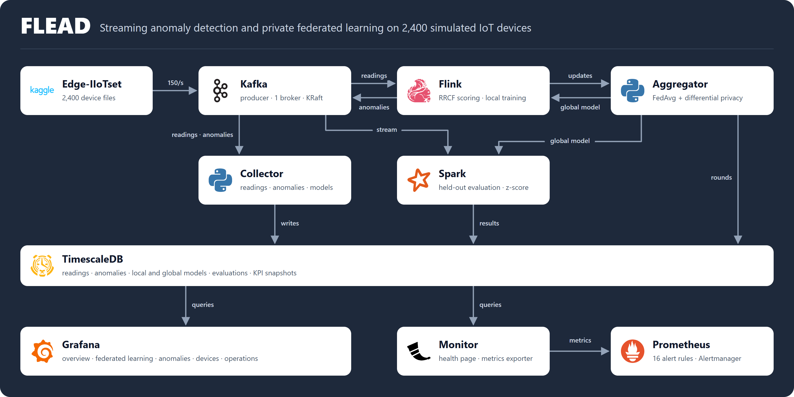
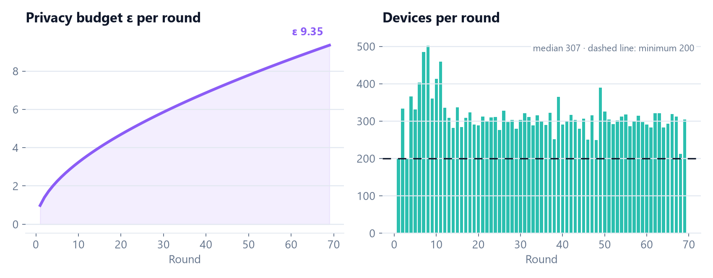
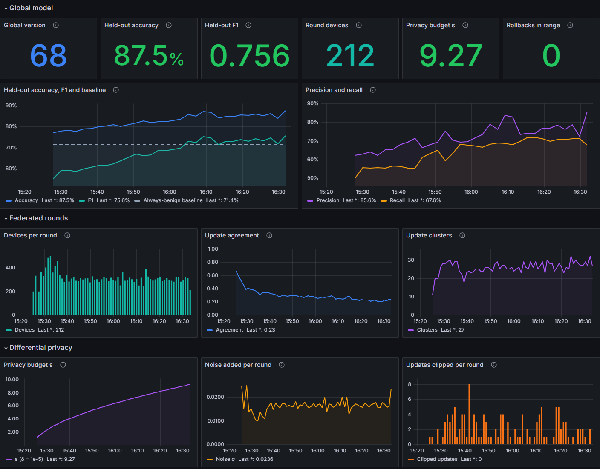
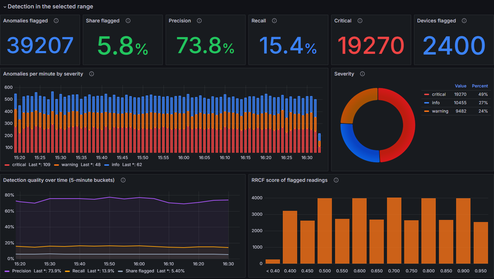
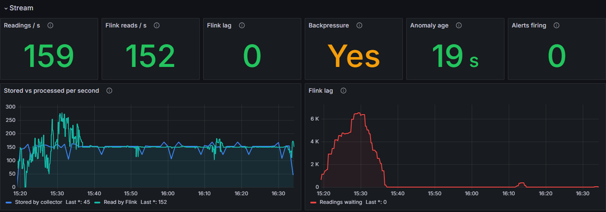
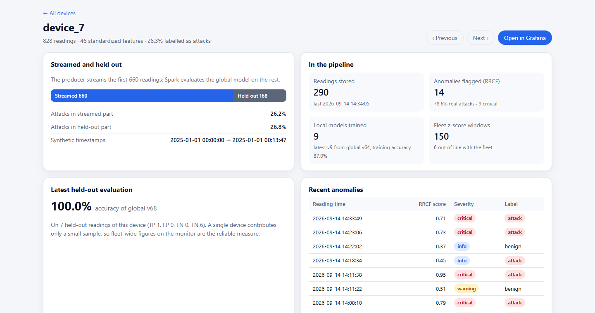

::: {.badges}
[](https://github.com/O-2wice/Federated-Learning-Anomaly-Detection)


:::

::: {.pitch}
**A real-time pipeline that watches 2,400 IoT devices for attacks and trains one
shared detector from all of them.** FLEAD streams the Edge-IIoTset
network-traffic dataset through Kafka, scores every reading in Flink, trains a
small model on each device, combines the device updates with differentially
private federated averaging, evaluates every shared model in Spark and shows
each stage live in Grafana and a monitor page.

It sets out to process a live IoT stream end to end with open-source tools,
train one attack detector across thousands of devices from their model
updates, measure detection on realistic labelled traffic, and make every stage
visible while it runs.
:::

[The pipeline]{.kicker}

## From device files to live dashboards

::: {.frame .frame-dark .column-body-outset}
{fig-alt="FLEAD architecture: Edge-IIoTset, Kafka, Flink, aggregator, collector, Spark, TimescaleDB, Grafana, monitor and Prometheus"}
:::

::::: {.grid .steps}

:::: {.g-col-12 .g-col-md-6 .g-col-lg-4 .step}
::: {.step-head}
[1]{.step-num} {.step-logo} [Data]{.step-title}
:::
Edge-IIoTset's 1,985,453 unique network flows, benign traffic and 14 attack
types, keep 46 standardized features and are split at random into 2,400 device
files.
::::

:::: {.g-col-12 .g-col-md-6 .g-col-lg-4 .step}
::: {.step-head}
[2]{.step-num} {.step-logo} [Stream]{.step-title}
:::
Kafka's producer replays every device at 150 readings/s. Each device streams
its first 660 readings and keeps the other ~167 for testing.
::::

:::: {.g-col-12 .g-col-md-6 .g-col-lg-4 .step}
::: {.step-head}
[3]{.step-num} {.step-logo} [Score and train]{.step-title}
:::
Flink scores each reading with a Random Cut Forest and retrains the device's
logistic regression after every 30 new readings.
::::

:::: {.g-col-12 .g-col-md-6 .g-col-lg-4 .step}
::: {.step-head}
[4]{.step-num} {.step-logo} [Aggregate]{.step-title}
:::
Every minute the aggregator merges the latest device updates with DP-FedAvg
into a new shared model for Flink and Spark.
::::

:::: {.g-col-12 .g-col-md-6 .g-col-lg-4 .step}
::: {.step-head}
[5]{.step-num} {.step-logo} [Evaluate]{.step-title}
:::
Spark tests every shared model on held-out readings and compares each device
with the rest of the fleet.
::::

:::: {.g-col-12 .g-col-md-6 .g-col-lg-4 .step}
::: {.step-head}
[6]{.step-num} {.step-logo} {.step-logo} [Store and monitor]{.step-title}
:::
TimescaleDB stores every stream and result; Grafana, the monitor page and
Prometheus alerts show each stage as it runs.
::::

:::::

[Stream and batch]{.kicker}

## Two speeds of processing

FLEAD combines continuous stream processing, which reacts to each reading
within seconds, with periodic batch processing, which summarises models and
devices over longer spans. Both write to TimescaleDB, so the dashboards show
them side by side.

:::: {.grid .flow}
::: {.g-col-12 .g-col-md-6 .stream}
[Stream processing]{.flow-title}
[continuous, per reading]{.flow-sub}

- **Kafka** carries readings, anomalies and model updates as keyed, ordered
  streams on four topics: `edge-iiot-stream`, `anomalies`,
  `local-model-updates` and `global-model-updates`.
- **Flink** handles each reading as it arrives: it scores the reading with the
  forest, adds it to the device's window and trains the device's model after
  every 30 new readings.
- **Spark Structured Streaming** groups the live stream into 30-second
  event-time windows with a one-minute watermark and flags devices whose mean
  sits more than 3 standard deviations from the fleet.
- **The collector** writes readings, anomalies and local model updates to
  TimescaleDB as they arrive.
:::

::: {.g-col-12 .g-col-md-6 .batch}
[Batch processing]{.flow-title}
[periodic, over many readings]{.flow-sub}

- **Federated rounds** run every 60 seconds over the latest update of each
  device, once at least 200 devices have reported.
- **Held-out evaluation** in Spark scores each new shared model over a cached
  sample of about 20,000 held-out readings, checking for a new version every
  120 seconds.
- **Device statistics** in Spark compute the daily mean, standard deviation,
  minimum and maximum of every device's stream metric from the device files.
- **KPI snapshots** summarise the whole fleet every 15 seconds: totals, active
  devices, anomaly rate and attack share.
:::
::::

[The tools]{.kicker}

## What each tool does here

::::: {.grid .tools}

:::: {.g-col-12 .g-col-md-6 .g-col-lg-4 .tool}
::: {.tool-head}
{.tool-logo} [Apache Kafka]{.tool-name}
:::
The backbone for real-time data: one broker in KRaft mode with four partitions
per topic carries every stream between the services.

[**Chosen for** a durable, partitioned log that several services read
independently at their own pace, with keyed messages that keep each device's
readings in order.]{.chosen}
::::

:::: {.g-col-12 .g-col-md-6 .g-col-lg-4 .tool}
::: {.tool-head}
{.tool-logo} [Apache Flink]{.tool-name}
:::
Runs the per-reading work, forest scoring and per-device training, on two
parallel workers with the stream keyed by device id.

[**Chosen for** stateful, low-latency stream processing: keyed streams send
each device to the worker that holds its training window and model.]{.chosen}
::::

:::: {.g-col-12 .g-col-md-6 .g-col-lg-4 .tool}
::: {.tool-head}
{.tool-logo} [Apache Spark]{.tool-name}
:::
Evaluates every shared model, analyses the live stream in windows and computes
per-device statistics, on a master and worker cluster.

[**Chosen for** one engine that covers both sides: Structured Streaming over
Kafka and batch jobs over held-out readings and device files.]{.chosen}
::::

:::: {.g-col-12 .g-col-md-6 .g-col-lg-4 .tool}
::: {.tool-head}
{.tool-logo} [Python services]{.tool-name}
:::
The federated aggregator (buffered FedAvg, differential privacy, model
registry, update clustering), the Kafka-to-TimescaleDB collector, the KPI
updater, and two Flask apps: the live monitor and the device viewer.

[**Chosen for** direct control over the federated algorithm and privacy
accounting, with NumPy for the model math.]{.chosen}
::::

:::: {.g-col-12 .g-col-md-6 .g-col-lg-4 .tool}
::: {.tool-head}
{.tool-logo} [TimescaleDB]{.tool-name}
:::
Stores readings, anomalies, local and global models, evaluations, fleet windows,
device statistics and KPI snapshots.

[**Chosen for** PostgreSQL with hypertables that partition data by time: every
service writes plain SQL, and recent data stays fast to query.]{.chosen}
::::

:::: {.g-col-12 .g-col-md-6 .g-col-lg-4 .tool}
::: {.tool-head}
{.tool-logo} [Grafana]{.tool-name}
:::
Five dashboards over TimescaleDB and Prometheus: overview, federated learning,
anomalies, devices and operations.

[**Chosen for** rich time-series panels over SQL and PromQL, provisioned from
dashboard JSON that FLEAD generates and tests in Python.]{.chosen}
::::

:::: {.g-col-12 .g-col-md-6 .g-col-lg-4 .tool}
::: {.tool-head}
{.tool-logo} [Prometheus and Alertmanager]{.tool-name}
:::
Scrape Flink, Spark and the monitor's metrics exporter, evaluate 16 alert rules
and send firing alerts to the monitor.

[**Chosen for** pull-based metrics and rule-based alerting, with exporters that
Flink and Spark provide.]{.chosen}
::::

:::: {.g-col-12 .g-col-md-6 .g-col-lg-4 .tool}
::: {.tool-head}
{.tool-logo} [Docker Compose]{.tool-name}
:::
Defines all services with health checks, startup order and shared volumes;
`START.bat` and `./start` bring the whole stack up and submit the Flink and
Spark jobs.

[**Chosen for** one command that runs the same stack on Windows, Linux and
macOS.]{.chosen}
::::

:::: {.g-col-12 .g-col-md-6 .g-col-lg-4 .tool}
::: {.tool-head}
{.tool-logo} [Edge-IIoTset]{.tool-name}
:::
The data source: labelled network traffic from IoT and industrial IoT devices,
downloaded from Kaggle and preprocessed in its own container. Next to benign
traffic it holds 14 attack types: DDoS floods over UDP, ICMP, TCP and HTTP, SQL
injection, XSS, password attacks, uploading, backdoor, ransomware,
man-in-the-middle, port scanning, vulnerability scanning and fingerprinting.

[**Chosen for** realistic, labelled cyber-security traffic that stands in for
private device data and lets both detectors be measured.]{.chosen}
::::

:::::

[Design decisions]{.kicker}

## The ideas behind it

:::: {.decision}
[Decision 1 · anomaly detection]{.decision-label}

### Random Cut Forest scoring

FLEAD scores every reading with a Robust Random Cut Forest. The forest learns
one point at a time, adapts as the traffic changes and looks at all 46 features
together, which suits many-dimensional network traffic. The fleet z-score in
Spark adds a second view: each device against the rest of the fleet.

**How a reading is scored.** A random cut tree splits its points with random
cuts, choosing each cut dimension in proportion to its range, so unusual points
end up isolated near the root. A reading's collusive displacement, how many
points would move if it were removed, is its raw anomaly score.

1. Insert the reading's 46 standardized features into each of 4 trees; each
   tree keeps its 256 most recent points.
2. Average the collusive displacement over the trees.
3. Rank it among the last 500 raw scores: the score is 0 up to the 90th
   percentile and rises linearly to 1 at the top.
4. Flag the reading when the score beats its device's threshold. The threshold
   starts at 0.4 and moves by 0.02 every 50 readings to keep about 5% of the
   device's readings flagged.

**Choices that mattered.** Using all 46 features of a reading raised ROC AUC
from 0.51 with a single feature to 0.65–0.66. One shared forest per Flink
worker compares every reading with current traffic across the fleet and keeps
memory small. And 4 trees × 256 points gave the best precision of the sizes
tested:

| Forest (60 devices, two samples) | ROC AUC | Readings flagged | Attacks among flagged |
| --- | --- | --- | --- |
| 1 × 256 | 0.54 / 0.55 | 6.0% / 5.9% | 62% / 60% |
| 2 × 256 | 0.55 / 0.60 | 6.3% / 6.0% | 44% / 54% |
| **4 × 256** | **0.65 / 0.66** | **6.1% / 6.0%** | **86% / 81%** |

**What it achieves.** In the live run the forest flagged 5.8% of readings, and
74% of them were attacks against a 28% base rate: about 2.6 times the rate of
random flagging. With a ROC AUC around 0.66 it is a strong ranking signal, and
it works as a label-free early warning next to the federated classifier. Each
flag carries its score, threshold, severity and the reading's true label, so the
dashboards show how many flags are real attacks.
::::

:::: {.decision .purple}
[Decision 2 · privacy]{.decision-label}

### Private aggregation

The aggregator keeps each device's latest update, its change since the global
version it started from, and runs DP-FedAvg every minute:

$$
\Delta_i = w_i - w_{\text{base}(i)}, \qquad
w_{\text{global}} \leftarrow w_{\text{global}} + \frac{1}{n}\sum_{i=1}^{n} \Delta_i \cdot \min\!\left(1, \frac{C}{\lVert \Delta_i \rVert}\right) + \mathcal{N}\!\left(0, \left(\frac{\sigma C}{n}\right)^{2}\right)
$$

With clip norm $C = 1$ and noise multiplier $\sigma = 5$, every extra device
lowers the noise. An offline run with 40 devices per round reached F1 0.58
against 0.73 with privacy off, which set the 200-device minimum. Live rounds
with a median of 307 devices keep the noise around 0.016 while accuracy climbs
from 0.770 to 0.875, and a Rényi-DP accountant tracks the budget: ε = 9.35 after
69 rounds. With privacy switched off, the average is weighted by each device's
sample count, as in classic FedAvg.
::::

::::: {.grid}
:::: {.g-col-12 .g-col-md-6 .decision .teal}
[Decision 3 · evaluation]{.decision-label}

### Scored on held-out readings

Every model version is scored on held-out readings with a full confusion matrix
and shown next to the always-benign baseline. The same F1 drives the model
registry, which republishes the best version whenever a newer one scores more
than 0.10 lower.
::::

:::: {.g-col-12 .g-col-md-6 .decision .orange}
[Decision 4 · streaming pace]{.decision-label}

### Training at the pace of the stream

Local training runs after every 30 new readings of a device, which keeps Flink
at the full 150 readings/s. A per-device offset from a hash of the device id
spreads training evenly, so federated rounds arrive about once a minute.
::::
:::::

[Results]{.kicker}

## What one run showed

One 77-minute run of the full pipeline. Held-out accuracy and F1 rise steadily
as rounds add device updates and the shared model settles.

:::: {.grid .stats}
::: {.g-col-12 .g-col-md-6 .g-col-lg-3}
[0.84–0.875]{.stat-value}
[held-out accuracy over the last 10 rounds (baseline 0.714)]{.stat-label}
:::
::: {.g-col-12 .g-col-md-6 .g-col-lg-3}
[0.72–0.76]{.stat-value}
[held-out F1 for attacks over the last 10 rounds]{.stat-label}
:::
::: {.g-col-12 .g-col-md-6 .g-col-lg-3}
[74%]{.stat-value}
[of flagged readings are attacks (base rate 28%)]{.stat-label}
:::
::: {.g-col-12 .g-col-md-6 .g-col-lg-3}
[150/s]{.stat-value}
[readings streamed, 694,999 of 695,000 confirmed]{.stat-label}
:::
::::

::: {.frame}
{fig-alt="Held-out accuracy and F1 per global model version, above the always-benign baseline"}
:::

| Metric | Result |
| --- | --- |
| Held-out accuracy / F1 | 0.770 / 0.553 after round 1; 0.840–0.875 / 0.717–0.756 over the last 10 evaluations (rounds 50–68); 0.858 / 0.739 at round 68 |
| Precision / recall (round 68) | 0.777 / 0.704 on 19,981 held-out readings |
| Always-benign baseline | 0.714 |
| Federated rounds | 69, median 307 devices per round (200–502) |
| Privacy | ε = 9.35 after 69 rounds (δ = 10⁻⁵), median noise σ 0.016 |
| Anomaly scoring | 5.8% of readings flagged, 74% of them attacks |
| Stream | 150 readings/s; 694,999 of 695,000 readings confirmed by Kafka |

::: {.frame}
{fig-alt="Privacy budget per round and devices per round above the 200-device minimum"}
:::

[Interfaces]{.kicker}

## See it running

::: {.frame}
```{=html}
<video src="images/monitor-live.webm" poster="images/monitor.png" autoplay muted loop playsinline
       aria-label="Live monitor during the run"></video>
```
[The live monitor during the run: overall status, model quality, privacy budget, latest round and Flink lag.]{.frame-caption}
:::

::: {.panel-tabset}

### Federated learning



### Anomalies



### Operations



### Device viewer



:::

[Scope]{.kicker}

## Scope and next steps

:::: {.grid .duo}
::: {.g-col-12 .g-col-md-6}
**Scope**

- **Simulated fleet:** devices are random slices of one dataset, and every
  reading also flows through Kafka and the database for measurement.
- **One Kafka broker.**
- **Logistic regression** as the classifier.
- **Privacy** protects each update as seen through the shared models, with a
  conservative ε.
:::

::: {.g-col-12 .g-col-md-6}
**Next steps**

- LSTM or GRU sequence models on each device's stream.
- Kubernetes deployment for scaling out and self-healing.
- Real IoT and edge devices in place of the dataset replay.
- A replicated multi-broker Kafka cluster.
:::
::::

[Try it]{.kicker}

## Run it yourself

```bash
START.bat     # Windows
./start       # Linux, macOS
```

Needs Docker with about 8 GB of memory and a Kaggle API token for the dataset.
Once the pipeline is up, the script opens the monitor
(<http://localhost:5001>) and Grafana (<http://localhost:3001>). The 53 unit
tests run on their own with `pytest tests`.

## Credits

::: {.credits}
**Data:** [Edge-IIoTset](https://www.kaggle.com/datasets/sibasispradhan/edge-iiotset-dataset)
(Ferrag et al., 2022). **Algorithms:** Robust Random Cut Forest (Guha et al.,
2016), FedAvg (McMahan et al., 2017), DP-FedAvg (McMahan et al., 2018),
buffered asynchronous aggregation (Nguyen et al., 2022), Rényi differential
privacy (Mironov, 2017). **Early prototype:**
[github.com/suu00k1459/OST](https://github.com/suu00k1459/OST).
:::
